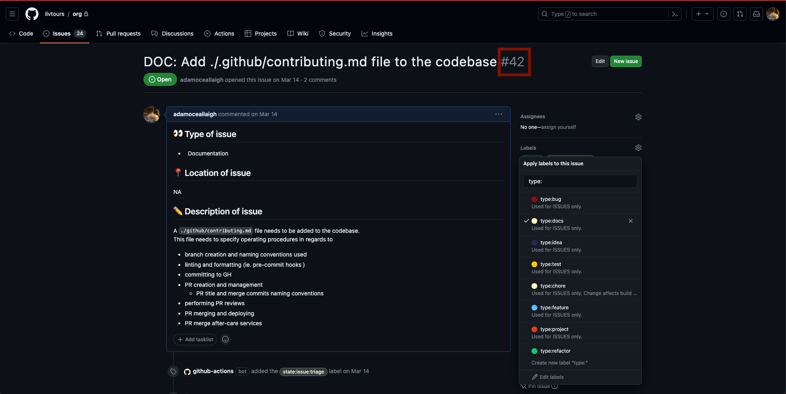

# Livtours Contribution Code Standards

Livtours follows a series of operating procedures and conventions when contributing code to the codebase. These are outlined below.

## Branch creation and naming conventions utilised

Upon tackling a new issue in our codebase,

1. Checkout and pull `default` branch (ie. `dev`, `staging`, etc..)

2. Create your new branch following the convention as follows:

`{ISSUE-ID}/{ISSUE-DESCRIPTION}`

where:

- ISSUE-ID: This the id automatically generated when the issue is created on Github.

  The id must:
   - be unique

  This can be found here:

  

 

- ISSUE-DESCRIPTION: This is a description of the issue.

  It must be:
   - clear
   - concise
   - sensical
   - self-explanatory

  It must contain:
   - ONLY lowercase characters
   - "-" as substitutes for spaces in multi-word descriptions

   

  A few examples of sample branches:
    1. `567/format-paragraphs-acc-page`
    2. `78/modify-cart-request-logic`
    3. `69/add-organisation-level-code-contribution-file`

 

## Local Precursory Review

Before requesting reviewers, there are a few considerations we need to take into account

- Final code optimization and examination
- Linting and formatting
- Testing
- Documentation

To enforce a uniform standard of code across our codebase, we have implemented CI and pre-commit hooks to perform these operations on our code according to predefined rules and commonly utilised ruleset settings.

CI Github workflows and use of pre-commit hooks by `Husky` make this possible.

- A final review of your code should be performed to reduce code review overhead by other contributors

  Aspects of code you should check include:

    **Global**

    - Newlines on last line of all files
    - Trailing spaces and log statements are removed
    - Necessary types and documentation are present
    - Explicit conditional checks are utilised
    - All edge cases along with happy paths are considered

    **Livtours-***
    - Globalization of all textual content

 

- Linting and formatting is language dependent.
     

    __PHP__

      Formatter: PHP-CS-Fixer
      Linter: Psalm

    __JS__

      Formatter: Prettier
      Linter: ESLint

    __HASKELL__

      Formatter: fourmolu,
      Linter: hlint, stan, and weeder

    __PURESCRIPT__

      Formatter: purs-tidy
      Linter: NA

 

- Testing is the cornerstone of producing operative code.

  Every commit to the `master` branch must be tested before merge.

  Include the appropriate test cases for your implemented code.

  This might include:

  - Manual flow tests
  - Unit tests
  - MLT(integration) tests
  - E2E tests

  __Manual Flow Tests__: These are tests performed by contributor by physically walking through the manual process you are working upon to ensure no edge cases and breaking points are present.

  __Unit Tests__: These are tests that focus on individual components or functions in isolation. They are typically low-level tests.

  __Integration Tests (ie. MLT's)__: These tests focus on the integration between different components or modules. They ensure that these components work together as expected. These could be considered mid-level tests.

  __End-to-End Tests__: These tests simulate real-world scenarios and interactions, typically spanning multiple components or even the entire application. They can be considered higher-level tests.

 

- Documentation is the last consideration that should be taken very seriously before committing code changes to the codebase.

  - All types and fns where necessary should be properly documented.
  Inherently, these comments need to follow the respective languages' comment standards.

  - No unnecessary comments or `@` tags  should be visible

  - Only avail of docblock syntax to further document types when language doesn't allow concise type declarations.

  Comment standards
  - PHP: `Docblock` or `Psalm`
  - JS: `JSDoc`

 

__IMPORTANT__

These are independent checks a contributor should ensure they've performed before requesting reviewers.
 

If unsure whether your changes break CI, tests or want to make a PR and have it ready, make an introductory Draft PR.

 

## PR creation and management

To add code to our codebase after following all above steps, you *must* create a new PR for your
changes.

Integration of new code into the codebase could be achieved only by a PR towards the `dev` branch.

Follow and fill in the `PULL_REQUEST_TEMPLATE` present. 
Link corresponding PR to the issue at hand by adding `Closes #{ISSUE-ID}` somewhere in `Description, Changes` section to PR body or add it manually.

> NOTE: Manual option is only available after PR creation from `Development` sidebar option.

If unsure about whether PR is ready for review, create a draft PR. 
Update PR to be full PR and ask for reviewers when ready.

If changes are requested,
1. Ask for clarification on changes necessary, if needed.
2. Don't be afraid to state your point of view on proposed changes.
3. Debate respectfully, acknowledge the other contributors point of view
4. Finalize decision and solution to identify whether changes are actually necessary
- If yes, make changes locally.  Follow ## Pre-committing to Github guidelines defined above and push changes to Github
5. Request re-review from contributors once ready again.

 

> General Terms: 

- For every PR, request a review from anyone who could provide relevant insight or has stakes into the modified code. 
- Every PR __requires__ approval by at least `one` other developer. 
 

If changes elsewhere are pushed to the `target` (ie. `dev`, `staging`) branch, your branch will need to pick up these new changes before adding your changes on top.

This inevitably means any branches that are at PR or review stage will need to be rebased with `target` (ie. `dev`, `staging`) branch before merging

1. Navigate to the local branch you are completing the changes upon.
2. Execute `git rebase ${TARGET_BRANCH(ie. dev)}`.
3. Observe potential merge conflicts
- If yes, resolve merge conflicts and execute `git rebase --continue` to resume the merge of `target` (ie. `dev`, `staging`) branch new code into your branch
- If no, message indicates `Successfully rebased with ${TARGET_BRANCH(ie. dev)` in CLI

 

## PR Review process

Upon request, a contributor is obligate to review another contributor's PR. 
The following guidelines need to be followed upon undertaking a review.

 Review should be:
 - Thorough
 - Articulate
 - Respectful
 - Split in two parts:

    Single Line Review Comments should consider:
    1. Syntax changes needed
    2. Misunderstanding of code provided
    3. Formatting adjustments required
    4. Additions/suggestions for improvements in code

    Overall Review Comment should consider:
    1. Allude to physical breakages/issues in CI, tests, etc...
    2. Mention any edge cases contributor didn't consider
    3. Overall review sentiment for the contributors
    4. PR next steps

 - a structured format for a potential debate

  Review processes should closely align with well respected flows dictated in:
  - https://google.github.io/eng-practices/review/reviewer/
  - https://chelseatroy.com/2019/12/18/reviewing-pull-requests/

 

---

Do not take abrupt change requests to heart, we are all striving to create the most elite, elegant, performant, secure solution possible for our codebase. 

You must understand that reviewing PR's is a time-consuming process and contributors might be sharp and to the point in an effort to save time.

However, just know every contribution and opinion is valuable and appreciated.

🥰⏳

---

 

## Merging and deploying

Once PR approval has been received from all appropriate reviewers, the contributor carrying out the first merge/deploy instance (to `dev` or to any other branch) is in charge.

#### Preparation

The decision of whether further squashing of PR sub-commits is necessary or not based on grouping capacity of the commits is at the discretion of this contributor.

If yes, the PR's will be squashed into distinguishable commit messages which add substance to what the commits were performing.

`After this point, no more squashing of commits is allowable`

If no, the commits will be pushed along the pipeline.

#### Deploying

The prepared commits are merged into the target branch and the responsible remote branch is deleted.

## Merge after-care services

Once notified by merger/deployer, your changes have been merged you may delete your local branch you were operating on.

REMEMBER:
Every change you make, it is __mandatory__ to follow this flow and these procedures. No matter the time!!!
