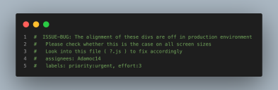
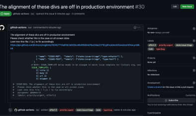
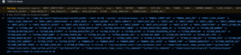

<div style="display: grid; margin: 2em;">
    
</div>

---

# Comment System
> ###### Documentation : Overview of comment system and workflow utilized throughout projects

---

## Decision-Making Principles

- Quick fire comments with <span style="color: #EF927B;">**TODO** </span>prefixes are all too common in codebases <br> 
eg. <span style="color: #09D17D">// **TODO:** Implement ?, &nbsp;where ? is task to be defined</span>

- These tasks are very rarely revisited and actual issues created which reference them.

- This system aims to prevent these scenarios. <br>
- The system utilizes [alstr/todo-to-issue-action@v4](https://github.com/marketplace/actions/todo-to-issue) GH action and the system’s outlined GH labels as defined in ./.github-labels

- Not including all of the TODO Options from GH action
  ```
    Assignees:  Yes
    Labels: Yes
    Milestones: No
    Projects: No
  ```

- Github Action default syntax is <span style="color:#EF927B">TODO</span> when creating a comment, this is ambiguous and isn’t suitable for the system in place with ./.github/labels

- Only one GH label group (aka, type) is utilized for a default automatic issue creation. 

- Other labels can be added and customized in the <span style="color:#EF927B ">labels :</span> key of the comment body

- Comment prefixes should be uppercase and include pre-prefix of <span style="color:#EF927B">ISSUE-*</span>. 
- This avoids unnecessary issue creation from prefix use in other codebase locations

- There should be no spaces in comment prefixes and “-” should be utilized for double syllable words/where multiple words are present.

- 1 to 1 mapping relationship between the label group “type” and comment prefix utilized.

- Comment prefixes longer than 5 letters were shortened to 3 or 4 letters, where applicable
eg.
  - <span style="color:#EF927B">**type:feature**</span> is mapped to FEAT
  - <span style="color:#EF927B">**type:refactor**</span> is mapped to REF

<br>

- Certain types from our <span style="color:#EF927B">**“type”**</span> label group will be used more frequently than others. 

- Some of which a reason or opportunity to deploy may not be foreseen.

- Most prominent prefixes expected to be utilized are: 
  - BUG
  - FEAT
  - IDEA
  - REF
  - TEST

  as these pertain mostly to code whereas other labels have inherent overhead and non-coding aspects to them.

- All prefixes should automatically add <span style="color:#EF927B">**state : issue : triage**</span> label on the new issues as they still need to be fleshed out, and thus are considered to be at the ‘triage’ stage of the issue.

- Comment prefixes must be placed within comment block/line of chosen language to take effect.
  ##### eg. <span style="color: #09D17D">// ?</span> , <span style="color: #09D17D">/* ? */</span> , <span style="color: #09D17D"> # ? </span> , <span style="color: #09D17D"> - ? </span>,  where ? is one of comment prefixes
<br>

- Comment prefixes absolutely matter as aforementioned, comments get chaotic without them. 

<br>

- For aforementioned reasons, ( <span style="color: #EF927B">eg.</span> label group type usage ) 
  ```
  The prefixes chosen are : 

      - ISSUE-BUG
      - ISSUE-FEAT
      - ISSUE-IDEA
      - ISSUE-REF
      - ISSUE-TEST
  ```

---
<br>

## Identifier Explanations

**ISSUE-BUG**: Implies issue is of type bug.<br>
Automatically applies the label(s)<br>


**ISSUE-FEAT**: Implies issue is associated with changes that enhance or add functionality to existing product/platform.<br>
Automatically applies the label(s)<br>


**ISSUE-IDEA**: Implies issue is associated with an innovative method or seed for enhancement. Needs to be explored further.<br>
Automatically applies the label(s)<br>


**ISSUE-IDEA**: Implies involves changes that restructure, rewrite or re-engineer existing code in a codebase. <br>
Automatically applies the label(s)<br>


**ISSUE-TEST**: Details that issue involves changes that deal directly with testing and testing suite/framework matters.<br>
Automatically applies the label(s)<br>


---

## Issue Creation 

In order to create a unified and clear workflow, these comment prefixes were created. 

A discussion <span style="color: #EF927B">**must**</span>  be had in order to alter or add new comment prefixes with everyone involved in the team in agreement.<br>
This ensures a streamlined approach to task management

<span style="color: #EF927B;">**NOTE**:</span> Workflows don’t exist independently from a Github repository so if same comment system is required in other repositories, a syncing operation needs to take place

In future versions, a syncing tool that performs this operation will be in charge of comment prefix creation.

---

## Comment Prefix Attachment/Usage

To create an automatic issue on GH from your IDE comment block, a particular structure is adhered to:
<pre>
  <code style="color: #09D17D">
  /* 
        { Prefix } : { Title }
          { Body }
        Optional (labels, assignees, etc)

        eg.  
        ISSUE-BUG: The alignment of these divs are off in production      
            environment
            Please check whether this is the case on all screen sizes
            Look into this file ( ?.js ) to fix accordingly
            assignees: @Adamoc14
            labels: priority:urgent, effort:3
  */
  </code>
</pre>

Subsequent lines after the prefix need to be indented by one single character recommended by @alistr’s comment [here](https://github.com/alstr/todo-to-issue-action/issues/146#issuecomment-1437415147)
<br>

So this upon push to GH:
<br>


<br>
<br>

Will create an automatic issue as depicted below :



following the template as outlined in .github/ISSUE_TEMPLATE.md
<br>

### <u>Optional Issue Configuration Parameters</u>
follows a <span style="color: #EF927B">key : value</span> pair structure

**assignees**: Username of the person/people responsibility of the issue should be given to <br>
**type**: [ List , comma separated ], as above example


**labels**: The additional labels to apply to the issue<br>
**type**: [ List , comma separated ], as above example


---

<br>

## Possible Configurations

As stated in the alstr/todo-to-issue-action@v4 [docs](https://github.com/marketplace/actions/todo-to-issue) there is a few possible configurations that can be made to alter the method by which the GH action functions

**CLOSE_ISSUES ( Boolean )** : By default, once a comment containing prefix is removed, the action attempts to close the associated issue. <br>This property is used to alter this behaviour. <br> **Default : true**
<br>

**IDENTIFIERS ( Array[ {} ] )** : These define the actual prefixes to use and the default labels to apply to each prefix. <br> 
```
eg. 
[
     { “name” :  “ISSUE-BUG”,  “labels”: [“type:bug”]},
     {
        “name” :  “ISSUE-FEAT”,  
        “labels”: [“type:feature” ,“priority:soon”]
      }
]
```

> NOTE: Ensure no trailing comma is present at the end of the last object entry, as this causes an error within the GH action

<br>

**ISSUE_TEMPLATE ( String | Markdown )** : Override the default issue template by providing your own as a value to this property. <br> 

> NOTE: Using .github/ISSUE_TEMPLATE.md as reference value. This ensures a synchronized template for manual and automatic issue creation across all repositories in an organization
<br>

**AUTO_P ( Boolean )** : Specifies whether in multiline comment blocks, each line should be taken as a new paragraph.<br> **Default : true**

**AUTO_ASSIGN ( Boolean )** : Specifies whether to assign the issue to the user triggering the action. If **'assignees'** are include in comment, this value is overridden.<br> **Default : false**

Other possible configurations are below ( as of date 6/3/2023 )

