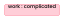
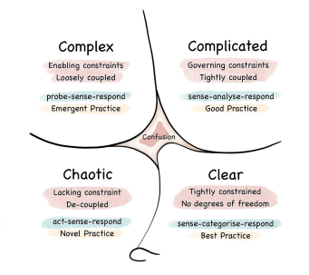
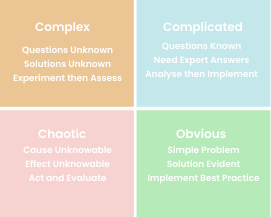
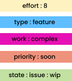
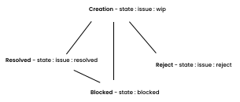

    

---

# Github Labels
> ###### Documentation : Overview of CRUD flow utilized throughout projects

---

## Decision-Making Principles

- Github labels are used for both Issues and PR’s ( Pull-Requests), therefore the label context should be agnostic where applicable.

- Labels should be lowercase. It’s easier to type and ensures less competition between label names.

- Labels and their associated colour should have a logical connection that is intuitive at-a-glance.

- Where labels are relevant to both Issues and PRs, a prefix will be omitted ( eg. *:* )

- Where label should only be utilized when referencing an issue, prefix of issue:* must be added

- This is the same when referencing only a PR ( eg. pr:*)

- Github default labels only describe one label group (aka, type) , this is not useful when concerned with PRs and other label groups are necessary

- The label group of priority should only be used once absolutely necessary therefore a decision was made to omit priority:low or any equivalent

- This would lead to task being passed over and is a suboptimal scenario.

- Github’s UI should render some tags discussed in thought process of decision-making as futile.
 For example, state:closed or state:approved.

- Once a PR is closed, an extra burden is placed upon someone to place closed label on PR.
 This is not necessary as UI marks PRs closed independent of labels.
 Same with an issue, an issue is never likely to be rendered approved.

- Prefixes absolutely matter as aforementioned, labels get chaotic without them.
 
 

The prefixes chosen are :

| Tag | Description |
| ----------- | ----------- |
|  | Relative effort involved, scaled using fibonacci from 1 to 13  |
|  | Designate immediacy of task involved |
|  | Description of state of Issue or PR |
|  | Description of issue involved  |
|  | Description of situation/complexity involved in bringing feature into fruition, or task to completion |
|  | Any label only applicable to PRs |
|  | Any label only applicable to Issues |

 
The only labels without prefixes are breaking, and help-needed

---

## Label Explanations

| Standard | Description | Priority | State | Type | Work
| ----------- | ----------- | ----------- | ----------- | ----------- | ----------- |
| 
Standard labels commonly used in most repositories.
 | 
Describes the relative effort to complete an issue or pull request.
 | 
Priority labels, but focused on describing the immediacy of attention required.
 | 
Describes the decision state of the issue or pull request.
 | 
Describes the type of issue or pull request.
 | 
Describes the kind of work involved in resolving the issue, using the [Cynefin framework](https://en.wikipedia.org/wiki/Cynefin_framework).
 |
| 
 | 
 | 
 | 
 | 
 | 
 |
|  |  | |  |  |  |
|  |  |  |  |  |  |
|  |  |  |  |  |  |
|  | |  |  |  |  |
|  |  |  |  |  |  |
|  |  |  |  |  |  | 
|  |  |  | |  |  |
|  |  |  |  | |  |
|  |  |  |  |  |  |
|  |  |  |  |  |  |

### <u>Standard</u>

breaking: Utilised when PR or issue will introduce a breaking change to the codebase

help-needed: Relevant when help is needed from another person with an issue or a PR

### <u>Effort</u>

effort : * : Relevant when help is needed from another person with an issue or a PR

### <u>Priority</u>

priority : * : &nbsp;Again Self explanatory, utilised to indicate the immediacy level of issue (eg. by now / urgent )

### <u>State</u>

state : blocked: Required to inform when state of a PR/ an issue is at a standstill or awaiting another item to be completed beforehand

state : needs-discussion : Implies issue/PR is in need of a discussion before further action is taken.

state : issue : triage: Assigned to an issue when first created and not yet been fleshed out/categorised

state : issue : dormant: Assigned to an issue that hasn’t been worked upon in a lengthy period of time

state : issue : reject: Utilized to inform all users that an issue has been rejected. No further work is required on this specific issue.

state : issue : resolved : Applied to indicate when an issue has been resolved. Again, no further action is required.

state : issue : wip : Employed to depict when work is currently being undertaken to resolve the issue at-hand

state : pr : nr : Applied to signal a PR needs reviews

state : pr : nd : Applied to signal a PR needs merge / deployment

state : pr : nc : Applied to signal a PR needs changes before any further action is taken

### <u>Type</u>

type : bug: Shows issue is of type bug

type : chore: Depicts issue is associated with changes that affect the build system, external dependencies, CI configuration files and scripts

type : docs: States issue is associated with changes that affect documentation

type : feature: Implies issue is associated with changes that enhance or add functionality to existing product/platform

type : idea: Implies issue is associated with an innovative method or seed for enhancement. Needs to be explored further

type : refactor: Implies involves changes that restructure, rewrite, or re-engineer existing code in a codebase.

type : project: States issue involves an entirely new time-intensive separate project or used to indicate a mock project

type : security: Informs that issue involves changes that deals directly with security matters

type : test: Details that issue involves changes that deal directly with testing and testing suite/framework matters

### <u>Work</u>

work : chaotic: Implies that the work involved in solving an issue has cause and effect unknowables. This is a situation where only course of action is to act and evaluate

work : complex: Implies that the work involved in solving an issue has unknown questions and solutions. This situation dictates that the only course of action is to experiment and then assess

work : complicated: Implies that the work involved in solving an issue has a difficult solution but known questions are at hand. Advise in this scenario is to obtain expert answers, analyze and then implement.

work : obvious: Implies that the work involved in solving an issue has a simple and evident solution. The advice given in this scenario is to implement best practice

    
     
    
    These pictures depict the Cynefin Framework.
    Framework is utilized for quantifying uncertainty.

### Resources:

1. [Simple version of framework](https://www.youtube.com/watch?v=L5fnxahydXM&list=PLQxPiNrHgSCqaDLp7HnncXQ5bN8DnU12n)
2. [Framework with simple examples](https://www.youtube.com/watch?v=YvWOTSEVSCY&list=PLQxPiNrHgSCqaDLp7HnncXQ5bN8DnU12n&index=3)

 

## Label Creation 

 In order to create a unified and clear workflow, these labels were created. A discussion must  be had in order to alter or add new labels with everyone involved in the team in agreement.
 
 This ensures a streamlined approach to task management
 
 

> Note: Labels don’t exist independently from a Github repository so if same label system is required in other repositories, a syncing operation needs to take place

 

In future versions, a syncing tool that performs this operation will be in charge of label creation.

 

## Label Attachment/Usage

As aforementioned, Github utilizes same labels across all of its product suite. This is not very helpful as some labels need exist for only specific products and not for others.

This formed the premise of my decision-making when it came to attaching labels to any product (PR or Issue). 

#### PRs only have four states:

##### Needs Reviews (state : pr : nr) : PR has been created, it is in progress and is seeking a reviewer
##### Needs Changes (state : pr : nc) : PR has been reviewed, it is of an unsatisfactory level to the reviewer. Changes need to be made
##### Needs Deploy (state : pr : nd) : PR has been approved by all reviewers and is ready to be merged
##### Blocked (state : blocked) : PR has been thwarted
 

Issues on the other hand at time of creation, should have access to all other labels mentioned in labels overview.

Once creating an issue, it is advised you select a label from each label group where applicable as this gives a more comprehensive overview of issue status, priority, and details.

<u>Don't double stack labels from the same group</u>

 For example,

<u>Task:</u> Want to build out a shopping cart into my e-commerce shop

<u>Labels applied might be: </u>

    

Again, state : pr : * labels are off limits, however state : blocked is available to use as it makes sense that an issue could also be blocked.

---

## Add Ons

With some label groups, there is a lifecycle encompassed within.
##### For example (eg. state of an issue )

    

 Future versions may look to automate these life cycles as much as possible. However for now, manual addition/removing as set out in these guidelines is <u>mandatory.</u>